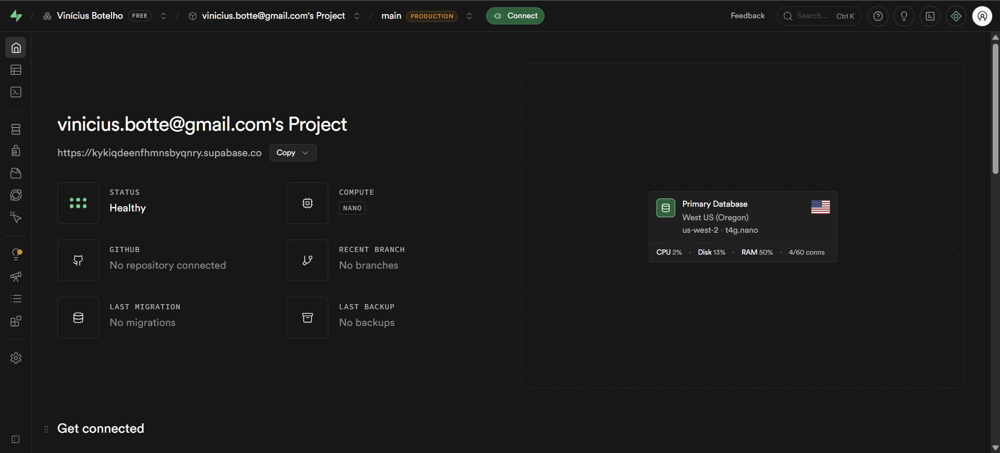
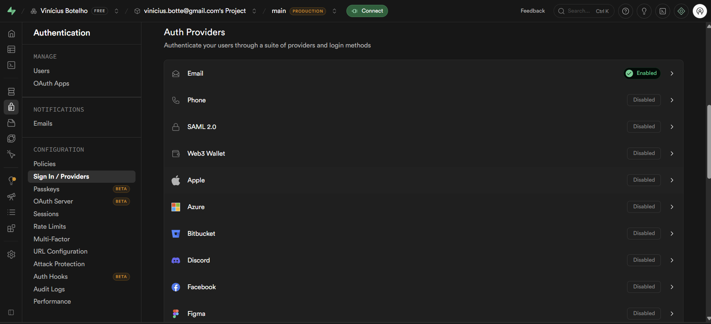
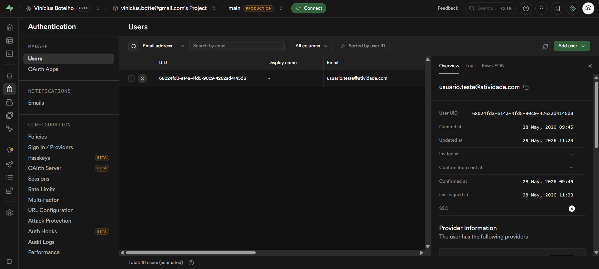
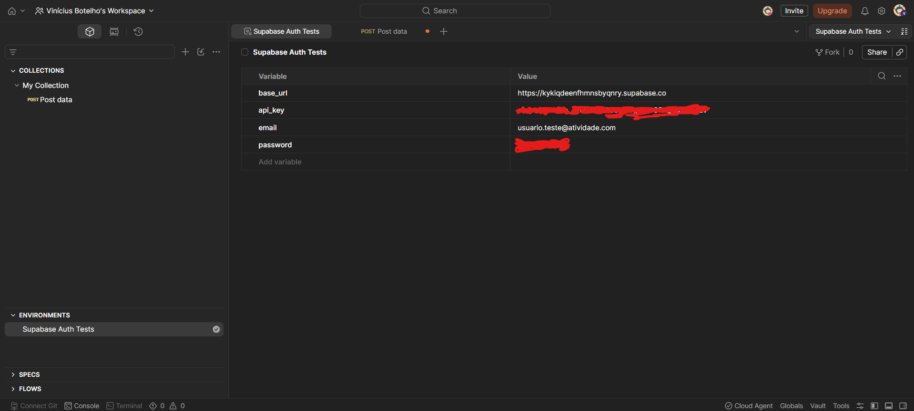
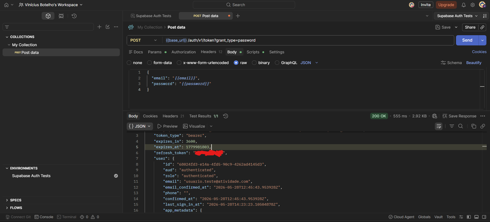
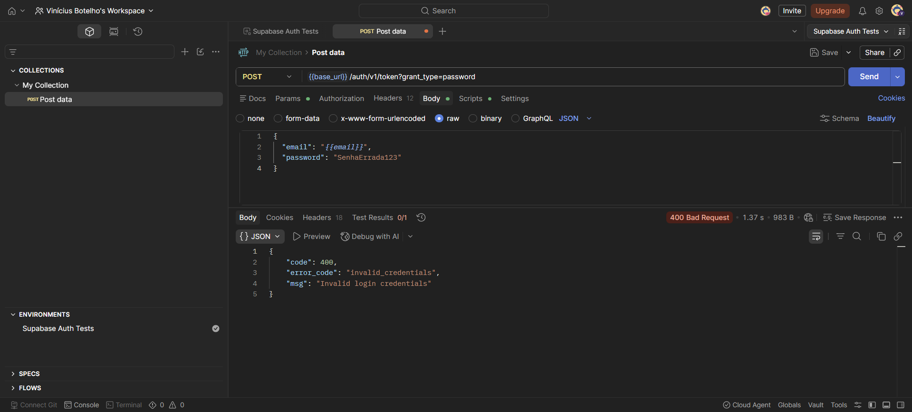
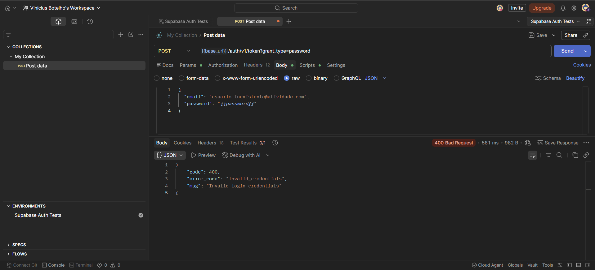
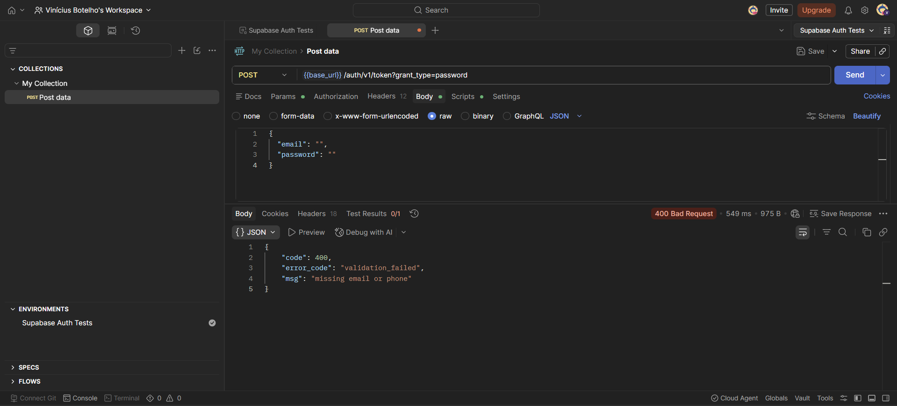
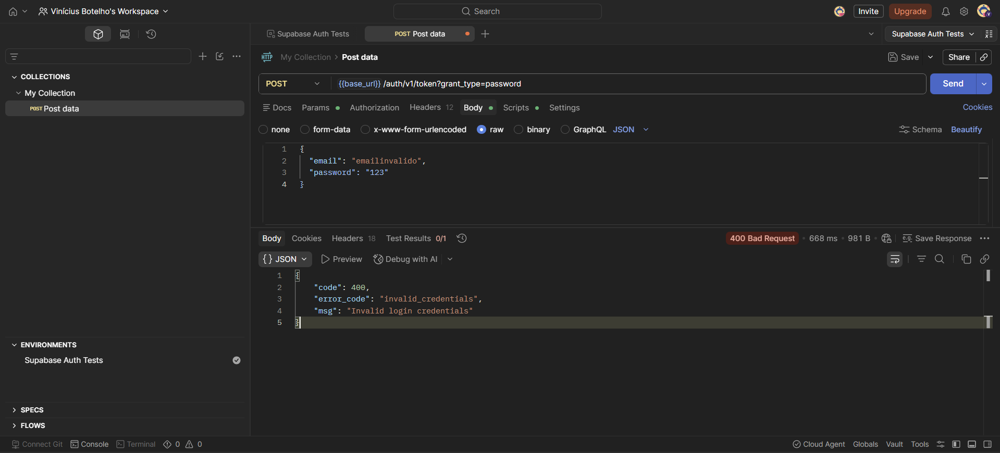

# Testes de Caixa Cinza em API de Autenticação com Supabase

## Introdução

Este repositório apresenta a configuração e execução de testes de caixa cinza em uma API de autenticação utilizando Supabase e Postman.

A atividade foi realizada com conhecimento parcial da estrutura do sistema, incluindo endpoint, headers, body JSON, autenticação e respostas HTTP. O objetivo foi validar o comportamento da autenticação em cenários válidos e inválidos, registrando evidências por meio de prints e planilha de testes.


---

## Objetivo da Atividade

O objetivo da atividade foi configurar um ambiente de autenticação no Supabase e executar testes funcionais com requisições HTTP no Postman.

Durante a atividade foram realizados os seguintes pontos:

- criação de projeto no Supabase;
- configuração de autenticação por e-mail;
- criação de usuário válido para testes;
- configuração de Environment no Postman;
- criação de requisição HTTP de login;
- execução de cenários de autenticação;
- validação de status HTTP, respostas JSON, mensagens de erro e retorno de token;
- documentação dos resultados no README e na planilha de testes.

---

## Estrutura do Repositório

```txt
/
├── README.md
├── postman/
│   ├── supabase-auth-collection.json
│   └── supabase-auth-environment.json
├── prints/
│   ├── supabase-projeto.png
│   ├── supabase-auth-email.png
│   ├── supabase-usuario.png
│   ├── postman-environment.png
│   ├── postman-login-valido.png
│   ├── postman-senha-incorreta.png
│   ├── postman-usuario-inexistente.png
│   ├── postman-campos-vazios.png
│   └── postman-credenciais-invalidas.png
└── planilha/
    └── registro-testes-supabase.xlsx
```

---

## Configuração do Supabase

Foi criado um projeto no Supabase para disponibilizar o serviço de autenticação utilizado nos testes.

A autenticação escolhida foi por **e-mail e senha**, pois esse método permite validar o processo de login utilizando requisições HTTP com envio de credenciais no corpo da requisição.

Também foi criado um usuário de teste para validar o cenário de login válido.

### Dados utilizados na configuração

| Item | Descrição |
|---|---|
| Plataforma | Supabase |
| Tipo de autenticação | E-mail e senha |
| Usuário de teste | `usuario.teste@atividade.com` |
| API URL | `https://kykiqdeenfhmnsbyqnry.supabase.co` |
| API Key | Ocultada por segurança |

### Evidências

Projeto criado no Supabase:



Autenticação por e-mail habilitada:



Usuário de teste criado:



---

## Configuração do Postman

Foi criada uma collection no Postman para organizar as requisições de teste da API de autenticação.

Também foi criado um Environment chamado **Supabase Auth Tests**, contendo variáveis utilizadas nas requisições. O uso de variáveis facilita a manutenção dos testes e evita a repetição manual de dados como URL, chave da API, e-mail e senha.

### Variáveis configuradas

| Variável | Finalidade |
|---|---|
| `base_url` | Armazena a URL base do projeto Supabase |
| `api_key` | Armazena a chave pública utilizada nos headers |
| `email` | Armazena o e-mail do usuário válido |
| `password` | Armazena a senha do usuário válido |

### Evidência

Environment configurado no Postman:



---

## Configuração das Requisições

Foi criada uma requisição HTTP do tipo **POST** para o endpoint de autenticação do Supabase.

### Endpoint utilizado

```txt
POST /auth/v1/token?grant_type=password
```

No Postman, a URL foi configurada utilizando variável:

```txt
{{base_url}}/auth/v1/token?grant_type=password
```

### Headers utilizados

| Header | Valor |
|---|---|
| `apikey` | `{{api_key}}` |
| `Authorization` | `Bearer {{api_key}}` |
| `Content-Type` | `application/json` |

### Body JSON utilizado no login válido

```json
{
  "email": "{{email}}",
  "password": "{{password}}"
}
```

A finalidade da requisição foi enviar as credenciais do usuário para o endpoint de autenticação e validar a resposta retornada pela API.

---

## Execução dos Testes

Foram executados cinco cenários obrigatórios de teste de autenticação.

| ID | Cenário | Entrada utilizada | Resultado esperado | Resultado obtido | Status |
|---|---|---|---|---|---|
| CT01 | Login válido | E-mail e senha corretos | Status 200 + access token | Status 200 OK e token retornado | Sucesso |
| CT02 | Senha incorreta | E-mail correto e senha incorreta | Erro de autenticação | Status 400 e `invalid_credentials` | Sucesso |
| CT03 | Usuário inexistente | E-mail não cadastrado e senha válida | Acesso negado | Status 400 e `invalid_credentials` | Sucesso |
| CT04 | Campos vazios | E-mail e senha vazios | Erro de validação | Status 400 e `validation_failed` | Sucesso |
| CT05 | Credenciais inválidas | E-mail inválido e senha inválida | Mensagem de erro | Status 400 e `invalid_credentials` | Sucesso |

---

## Evidências dos Testes

### CT01 - Login válido

Resultado obtido: **Status 200 OK** com retorno de `access_token`.



### CT02 - Senha incorreta

Resultado obtido: **Status 400 Bad Request** com erro `invalid_credentials`.



### CT03 - Usuário inexistente

Resultado obtido: **Status 400 Bad Request** com erro `invalid_credentials`.



### CT04 - Campos vazios

Resultado obtido: **Status 400 Bad Request** com erro `validation_failed`.



### CT05 - Credenciais inválidas

Resultado obtido: **Status 400 Bad Request** com erro `invalid_credentials`.



---

## Registro dos Testes

Os testes foram registrados em uma planilha contendo os seguintes campos:

- ID do teste;
- cenário;
- entrada utilizada;
- resultado esperado;
- resultado obtido;
- status HTTP;
- status do teste;
- observações;
- evidência.

A planilha está disponível em:

```txt
planilha/registro-testes-supabase.xlsx
```

---

## Resultados Obtidos

A API respondeu corretamente aos cenários testados.

No cenário de login válido, a autenticação foi realizada com sucesso e a resposta retornou status **200 OK**, além de um `access_token`.

Nos cenários inválidos, a API bloqueou o acesso e retornou mensagens de erro adequadas, como `invalid_credentials` e `validation_failed`.

Resumo dos resultados:

| Tipo de teste | Quantidade |
|---|---:|
| Total de testes executados | 5 |
| Testes com sucesso | 5 |
| Testes com falha | 0 |

---

## Conclusão

A atividade permitiu compreender, na prática, o funcionamento de testes de caixa cinza aplicados a uma API de autenticação.

Durante o processo, foi configurado um projeto no Supabase com autenticação por e-mail e senha, além da criação de um usuário válido para testes. Em seguida, as requisições foram configuradas no Postman utilizando variáveis de ambiente, headers e body JSON.

Os testes executados validaram diferentes comportamentos da autenticação, incluindo login válido, senha incorreta, usuário inexistente, campos vazios e credenciais inválidas. O cenário válido retornou status 200 e access token, enquanto os cenários inválidos retornaram erros de autenticação ou validação.

As principais dificuldades encontradas estiveram relacionadas à configuração correta das variáveis do Postman e à montagem do body JSON. Após os ajustes, todos os cenários obrigatórios foram executados corretamente.

Como melhoria, poderiam ser implementados testes adicionais para expiração de token, refresh token, bloqueio por múltiplas tentativas inválidas e validação de políticas de segurança.

Os testes de caixa cinza são importantes em APIs porque permitem validar o comportamento do sistema com base em conhecimento parcial da sua estrutura, ajudando a identificar falhas de autenticação, problemas de validação e inconsistências nas respostas HTTP.
